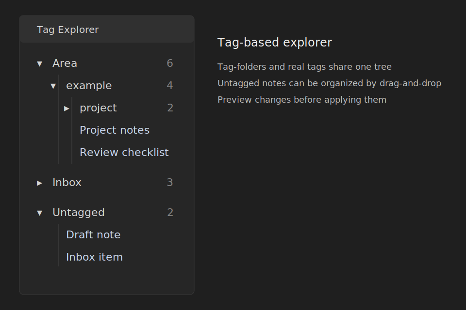
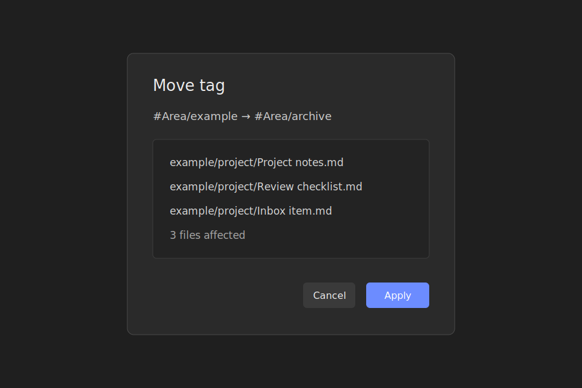

# Tag Explorer

Tag Explorer is an Obsidian community plugin that provides a tag-based file explorer. It shows nested tags as a tree, supports tag-folders, and helps organize untagged notes without leaving the side pane.

## Features

- Browse notes by nested tag hierarchy.
- Switch between all Obsidian-recognized tags and file-property-only tags.
- Show untagged notes in a separate section and drag them onto a tag.
- Create, rename, move, and delete tag-folders.
- Drag notes and tag subtrees with a preview before files are changed.
- Rename and delete notes from the Tag Explorer context menu or keyboard.
- Sort tags and notes, filter the visible tree locally, and persist expanded tags.
- Use English or Russian UI strings based on Obsidian language.

## File changes and safety

Tag Explorer can write to your vault only after an explicit action:

- Moving or renaming a tag updates matching tags in file properties and recognized inline tags.
- Moving an untagged note to a tag adds that tag to file properties.
- Renaming notes uses Obsidian's `FileManager.renameFile`, so Obsidian can update links according to your settings.
- Deleting notes uses Obsidian's `FileManager.trashFile`, so deletion follows your Obsidian trash settings.
- Tag move, rename, and add operations show a preview before applying changes.

Make a vault backup before running large tag operations.

## Privacy

The plugin does not use telemetry, external network requests, or remote services. Plugin data is stored locally in the vault plugin data file and may include local tag-folder paths and expanded tag state.

## License

MIT
